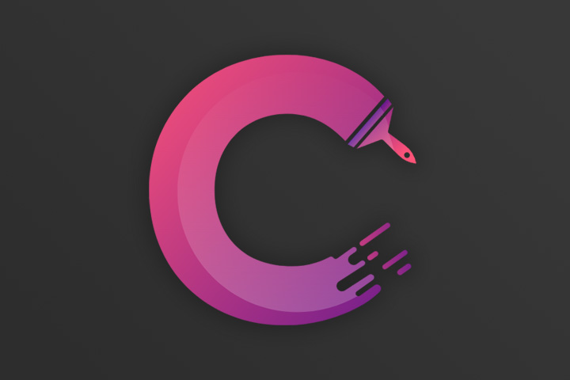
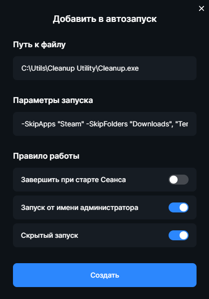

<div align="center">



# Cleanup Utility

**Утилита для очистки данных сессии пользователя**


[](./README.md)
[](./README.en.md)


</div>

> [!NOTE]  
> Данная утилита представлена исключительно для ознакомления! Разработчик не несет ответственности за удаленные с ваших компьютеров файлы и некорректную работу программ с которыми работает данный скрипт! Всем добра :heart:

## Для чего?

Cleanup предназначен для автоматического удаления данных сессии последнего пользователя ПК, таких как: аккаунты в различных приложениях, история браузера, а также удаления временных файлов и разного рода мусора.

## Как работает?

После запуска, Cleanup автоматически завершает все необходимые процессы, удаляет данные приложений и очищает системные папки.

1. **Лаунчеры**
    - Steam
    - Epic Games
    - EA App
    - Battle.net
    - VK Play
    - Riot Games
    - Lesta Games
    - Wargaming.net
    - Ubisoft Connect
    - Battlestate Games
    - Arena Breakout Infinite
    - Rockstar Games Launcher
    - Roblox

2. **Связь**
    - Discord
    - Telegram
    - TeamSpeak 3
    - TeamSpeak 6
    - WhatsApp

3. **Браузеры**
    - Google Chrome
    - Firefox
    - Opera GX
    - Microsoft Edge
    - Яндекс.Браузер

4. **Другое**
    - FACEIT Client
    - MarketApp


5. **Системные папки**
    - Загрузки
    - Изображения
    - Видео
    - Музыка
    - Корзина
    - Temp (временные файлы пользователя)
    - SystemTemp (временные файлы системы)
    - CrashDumps (дампы крашей)
    - Thumbnails (кэш миниатюр)


Список пополняется по мере поступления запросов на добавление той или иной программы.


## Как использовать?

> [!NOTE]  
> Если вы использовали утилиту раньше, не забудьте удалить старую версию

1. Скачиваем последнюю версию **[тут](https://github.com/cor3jz/PS-Cleanup/releases/latest)**
2. Распаковываем архив в любое удобное место
3. Для очистки по умолчанию (все приложения и системные папки), просто добавляем `cleanup.exe` в автозагрузку любым удобным способом
4. Для исключения того или иного приложения из очистки, добавляем параметр запуска `-SkipApps` и названия приложений которые будут исключены
5. Для исключения той или иной папки из очистки, добавляем параметр запуска `-SkipFolders` и названия папок которые будут исключены
6. Названия программ для исключения указывайте так, как написано в файле `launch-keys.txt`, который находится в папке Docs

## Примеры

1. Стандартная очистка:
```
C:\Path\To\Cleanup.exe
```

2. Очистка с исключением некоторых программ:
```
C:\Path\To\Cleanup.exe -SkipApps "Steam", "Chrome"
```

3. Очистка с исключением системных папок:
```
C:\Path\To\Cleanup.exe -SkipFolders "Downloads", "Temp"
```

4. Очистка с исключением программ и системных папок:
```
C:\Path\To\Cleanup.exe -SkipApps "Steam", "Chrome" -SkipFolders "Downloads", "Temp"
```

5. Пример добавления Cleanup в автозапуск в SmartShell



## Обновления

Cleanup может автоматически обновляться до последней версии. Запустите `updater.exe` для проверки наличия обновлений и загрузки новой версии.
Также вы можете добавить `updater.exe` в планировщик задач, для автоматической проверки обновлений.

> Пример еженедельной проверки обновления:
```
# Создание задачи с помощью schtasks.exe
schtasks /CREATE /TN "Cleanup Update Checker" /TR "C:\Path\To\update.exe" /SC WEEKLY /D MON /ST 09:00 /RU "SYSTEM" /RL HIGHEST /F
```