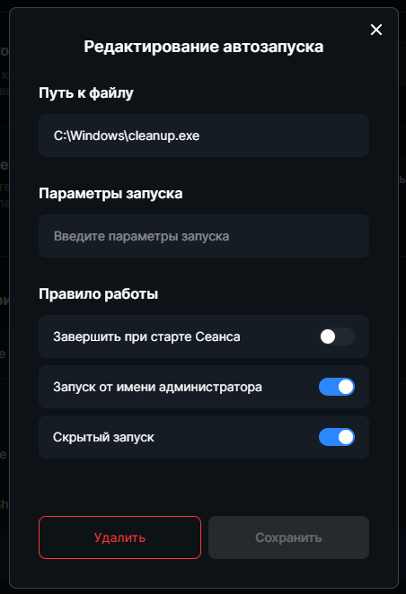

# Logout & Cleanup script 
Данный скрипт удаляет данные пользователей в **Discord, Faceit, Battle.net, Origin, Steam, Google Chrome**, а также очищает кэш этих приложений, удаляет временные файлы `AppData/Local/Temp`, дампы крашей приложений и чистит корзину на всех дисках.  
Для удобства использования скрипт скомпилирован в исполняемый файл и вы можете использовать его как есть, например добавить в автозапуск в SmartShell или создать задачу при выключении ПК.  
Либо, вы можете внести свои изменения в **PowerShell** скрипт и самостоятельно скомпилить его в exe с помощью, например [ps2exe](https://github.com/MScholtes/PS2EXE).  

P.S. Возможно, Windows Defender будет ругаться на `PUA:Win32/Pearfoos.B!ml`, просто добавьте в исключение   
P.P.S. Для сторонников теорий заговора: PUA явлется ложным срабатыванием, и не является вирусом. Большинство программ, которые не имеют издателя, могут помечаться как PUA.

#### Пример использования в SmartShell
1. Закинуть файл cleanup.exe куда вам удобно, например в C:\Windows
2. Добавить автозагрузку в Настройках

  

## Обновление 0.0.2.0
1. Из таких каталогов **Steam** как: `/appcache`, `/config` и `/userdata` удаляются файлы только старше 24 часов.
2. Использоввание переменных окружения вместо названий некоторых каталогов.
3. Добаввлена цифровая подпись **Sophia Project**.

